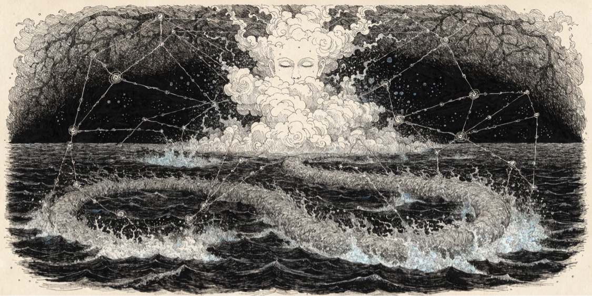

<p align="center"></p>

# aelfrice

> Your AI agent stops forgetting.
> Set up aelfrice once. After that, it runs without interrupting your work.
>
> _No cloud. No account. No telemetry._

[](https://pypi.org/project/aelfrice/)
[](https://pypi.org/project/aelfrice/)
[](LICENSE)
[](https://github.com/robotrocketscience/aelfrice/actions/workflows/ci.yml)

You correct your agent. *"Got it,"* the agent says. In the next session, the agent makes the same mistake.

aelfrice runs in the background and stops that memory loss. Write a rule once, and every relevant prompt after that carries it. The hook injects the rule *before* the model reads your message. There is no rules file to maintain, and nothing for the agent to skip, because the matched beliefs are in the prompt itself.

aelfrice is for developers who use AI coding agents. Any host that supplies a `UserPromptSubmit` hook gets full support. A tool cannot put the right beliefs in front of the model before the model reads your message, because the tool runs only if the model calls it, so the hook is what makes the guarantee possible. aelfrice is local-only by design, which puts embeddings, vector retrieval-augmented generation (RAG), and cloud synchronization out of scope. [Philosophy](docs/concepts/PHILOSOPHY.md) explains why that trade-off is worth it.

## Install

```bash
uv tool install aelfrice    # requires uv — https://docs.astral.sh/uv/
aelf setup                  # wire the UserPromptSubmit hook into your agent
aelf onboard .              # deterministic project scan (regex classifier). For LLM-quality with no API key, run /aelf:onboard in your agent.
aelf lock "never push directly to main; use scripts/publish.sh"
```

That is the whole setup. The next prompt that mentions "push" already carries the rule, and aelfrice asks nothing of you after that: no command to remember, no file to keep current.

If you use the Codex CLI, run `aelf setup --host codex`. That command installs the same set of hooks into the `hooks.json` file of `$CODEX_HOME` or `~/.codex`, and it installs the `/aelf:*` command bundle as `$aelf-*` agent skills (v4.1.0+). For the details, read [INSTALL § Codex host](docs/user/INSTALL.md).

## What you'll see

You type a message in your agent. The aelfrice hook runs before the model reads the message, and it injects the matched beliefs at the start of the message, in an `<aelfrice-memory>` block:

```text
<aelfrice-memory>
The following are retrieved beliefs from the local memory store. ...
<belief id="a1f3c2d0" lock="user">never push directly to main; use scripts/publish.sh</belief>
<belief id="91e02d3c" lock="user">commits must be SSH-signed with ~/.ssh/id_ed25519</belief>
<belief id="77c01b2a">the publish script runs the release checks before tagging</belief>
</aelfrice-memory>

push the release
```

The model reads all of this as one message. Your rules arrive with every relevant prompt, not only when the agent opens a file.

## What it does for you

Lock a rule once with `aelf lock "..."`, and aelfrice injects it into every relevant prompt in every later session. aelfrice does the reminding for you. The model cannot skip the rule, because the rule is already in the prompt when the model starts reading. It is not in a file that the model can pass over.

There is also nothing to maintain. Passive capture logs each turn, ingests each turn, and ingests the message of each successful `git commit`. The memory grows while you work, and you don't have to type `aelf` to make that happen.

All the data stays on your computer, in a single SQLite file. There is no cloud account and no telemetry. If you stop trusting aelfrice, `aelf uninstall` removes it in one command, and the `--archive` option encrypts the database to a file first.

## Why not a rules file?

A rules file is advice that the agent *might* read. aelfrice is context that the model *has already read*. By [Leonard Lin's standard](https://github.com/lhl/agentic-memory/blob/main/ANALYSIS.md), "a vector store with a similarity query" is also not a memory system. A memory system has to answer these questions: *who wrote this, when, through what ingress, what supersedes it, and how do I take it back.* aelfrice meets the four pillars directly: provenance, write gates, conflict handling, and reversibility. [COMPARISON.md](docs/concepts/COMPARISON.md) compares aelfrice against hand-maintained rules files and vector stores.

## Day-to-day

You rarely type `aelf` again after you run `aelf setup`. These are the everyday commands:

```text
aelf onboard .                      # once per project — deterministic scan (or /aelf:onboard for the no-key subagent flow)
aelf lock "never push to main"      # add a permanent rule
aelf locked                          # see what rules are active
aelf search "push to main"           # check what the agent will see
aelf status                          # quick health summary
aelf setup / aelf doctor            # initial install + verification
aelf feed                            # read the belief-write event log (v3.5+)
aelf stale --older-than 90 --cold-for 30   # surface forgotten beliefs (v3.5+)
aelf review --generate               # weekly keep / remove / lock checkpoint (v3.5+)
```

`aelf --help` shows the everyday commands, and `aelf --help --advanced` lists the rest. [COMMANDS](docs/user/COMMANDS.md) is the full reference. aelfrice offers the same operations as `/aelf:*` slash commands, which call the same library. For those, read [SLASH_COMMANDS](docs/user/SLASH_COMMANDS.md).

## How it works

Three retrieval lanes run on every prompt. A fourth lane, breadth-first search (BFS) graph expansion, runs only when you enable it. aelfrice injects the best matches at the start of your prompt, and the model reads all of it as one message.

```text
L0: locked beliefs   -> rules you marked permanent (always returned, never trimmed)
L2.5: entity index   -> deterministic NER-extracted entity lookup, exact + stem match
L1: FTS5 keyword     -> SQLite full-text search, BM25 + posterior-weighted rerank
L3: graph walk       -> typed-edge BFS from the L0+L2.5+L1 seed set (DERIVED_FROM, CONTRADICTS,
                        SUPERSEDES, RELATES_TO, ...) — opt-in: [retrieval] bfs_enabled = true
```

<p align="center"></p>

<p align="center"><sub><i>The figure is illustrative. The figure is not a trace of a real store. The L0 locked rules always return. A query on FTS5 and BM25 seeds L1. When you enable the L3 lane, the L3 graph walk steps along typed edges one hop at a time. The separate lane for the structural HRR (<code>retrieve_v2</code>) connects to matches that share no vocabulary with the query. The color gives the lane. The distance from the center gives the depth of the graph walk. The figure omits the L2.5 entity-index lane, to keep the figure legible. <a href="docs/assets/render_retrieval_lanes.py">render_retrieval_lanes.py</a> rendered the figure.</i></sub></p>

aelfrice always returns L0. When you enable L3, aelfrice trims L1, L2.5, and L3 to the budget; otherwise it trims L1 and L2.5. The trim runs against the merged candidate set in order of descending score, and the locked beliefs win every overflow. The default budget is 1,500 tokens for each prompt that the hook injects into, and 2,400 tokens for `aelf search` and for the library function `retrieve()`. A separate structural-HRR lane uses the Plate-FFT bind and probe operations. That lane takes the queries that parse as structural markers in the `retrieve_v2` API, and ordinary prompts never reach it.

Your count of locks is also the budget for your baseline context. If you lock 200 statements, each session opens with all 200 statements, by design. aelfrice ranks each unlocked belief with BM25 and then trims the unlocked beliefs to the budget. The first prompt of a new session carries one extra block: a `<session-start>` sub-block that lists all your locks plus the load-bearing unlocked beliefs: those with a corroboration ≥ 2, or a posterior mean ≥ ⅔ with α+β ≥ 4. Later prompts in the same session skip the sub-block.

The query that reaches BM25 is your raw prompt. From v3.0, the default was a `stack-r1-r3` rewriter that does entity expansion and per-store clipping of the inverse document frequency (IDF). That default came from a measured +0.2851 absolute normalized discounted cumulative gain at k (NDCG@k) on a labeled corpus. Issue #1177 then replaced the conjunctive FTS5 match with a disjunction over the rarest tokens. The conjunctive match was what dropped recall, and the rewriter existed to compensate for that drop, so issue #1501 reverted the rewriter once the drop was gone. On the same 30 rows, the raw-query arm scored 0.9553, against 0.8229 for the rewriter. To select the rewriter anyway, set `[rebuilder] query_strategy`. **Both figures come from a labeled corpus that is not shipped in
this repository**, so you cannot reproduce either figure from a public clone. The gate in this repository is
[`tests/bench_gate/test_query_strategy.py`](tests/bench_gate/test_query_strategy.py), and it skips without
`AELFRICE_CORPUS_ROOT`. When the gate does run, it asserts that the shipped default is the winning arm rather than checking a
quoted number. For figures you can reproduce on HEAD, read the scripts under [`benchmarks/`](benchmarks/). [ARCHITECTURE § Retrieval](docs/concepts/ARCHITECTURE.md#retrieval) gives the full wiring of the lanes, the composition, and the federation peer databases.

## Memory model

Each belief carries a `(α, β)` Beta-Bernoulli posterior. `α / (α+β)` is the confidence, and `α + β` is how much evidence backs that confidence. A new belief starts at low evidence and high variance: aelfrice can retrieve it, but discounts it. A locked belief does not decay, because aelfrice pins it as ground truth.

| You run | aelfrice stores |
|---|---|
| `aelf lock "never commit .env files"` | A permanent rule. aelfrice returns it on every retrieval. |
| `aelf onboard .` | The `aelf onboard` command walks the project. The command reads the git log, the headings in the prose and the structure of the code. The command then ingests the structural facts as `agent_inferred` beliefs with the deterministic regular-expression classifier. |
| `/aelf:onboard` | The same scan, with a higher-quality classification. In-session subagents drive the classification. No API key and no billing are necessary. `/aelf:onboard` is the preferred path in an agent. The `aelf onboard` command alone is the deterministic fallback. |
| `aelf feedback <id> used` | `α += 1`. The command strengthens the posterior of the belief. |
| `aelf feedback <id> harmful` | `β += 1`. The command weakens the posterior of the belief. A lock resists passive feedback, by design. To change a lock, run `aelf unlock` or `aelf delete`. |
| `aelf promote <id>` | The `aelf promote` command flips `origin` from `agent_inferred` to `user_validated`. With `--to-scope <SCOPE>`, the command also moves the federation visibility to `project`, `global` or `shared:<name>`. |
| `/aelf:wonder <topic>` | The `/aelf:wonder` command researches the topic. The command writes the findings as `speculative` phantoms. The `/aelf:reason <topic>` command can then walk those phantoms. |
| _(passive — no command)_ | Passive capture is on by default. aelfrice logs each turn of prompt and response. aelfrice ingests each turn at compaction. aelfrice also ingests each successful `git commit` event. To opt out of one hook, use one of these options: `aelf setup --no-transcript-ingest`, `--no-commit-ingest`, `--no-session-start`, `--no-stop-hook`, `--no-sessionstart-recap`, `--no-search-tool`, `--no-search-tool-bash`, `--no-pre-issue-guard`, `--no-claude-memory-mirror`, `--no-agent-context`. For more data, read [INSTALL § default-on hooks](docs/user/INSTALL.md). |

Each belief has an `origin` column that ties the belief to the action that wrote it. The value is one of `user_stated`, `user_corrected`, `user_validated`, `user_transcript`, `agent_inferred`, `agent_remembered`, `document_recent`, `speculative`, or `unknown`. The store is a single SQLite file, and you can open it in any browser. Nothing is hidden.

## Reasoning surfaces

Two slash commands let the agent query the belief graph during a turn, beyond the retrieval block that aelfrice injects automatically. The two work together: `/aelf:wonder` grows the graph by researching, and `/aelf:reason` walks the enriched graph for structured verdicts.

**`/aelf:wonder <topic>`** is the research surface. You give it a topic, and aelfrice runs a gap analysis on what the store already holds, then generates 2–6 orthogonal research axes. The axes `domain_research` and `internal_gap_analysis` are always on, and `contradiction_resolution`, `uncertainty_deep_dive`, and `coverage_extension` are conditional. The host agent then dispatches one research task for each axis, and each task researches its axis and writes up the findings. aelfrice persists the merged research as new speculative beliefs with `wonder_ingest`. Those phantoms sit in the graph at low evidence, where retrieval and the next `/aelf:reason <topic>` can both find them. They stay speculative until you promote them with `aelf promote`. If you lock the statement behind a phantom, aelfrice promotes the matching phantom for you. aelfrice also recognizes an agent-count shorthand in the query string, for example `quick 2-agent` or `deep 4-agent`: the integer sets the agent count, and `quick` and `deep` are optional qualifiers.

**`/aelf:reason <query>`** is the structured-walk surface. It walks the belief graph from starting points that BM25 seeds, and it emits a typed reasoning trace. The trace holds the hops, each carrying its edge type. It holds a `VERDICT` of `SUFFICIENT`, `PARTIAL`, `UNCERTAIN`, `INSUFFICIENT`, or `CONTRADICTORY`. It holds `IMPASSES`, which are typed gaps, ties, or constraint failures. It holds `SUGGESTED UPDATES`, each one a `(belief_id, direction, note)` row. Those fields map straight onto `aelf feedback`, so the conclusion closes the loop on the beliefs that fed it. The host agent dispatches each impasse to a role-tagged worker: Verifier, Gap-filler, or Fork-resolver. aelfrice annotates a peer hop in a foreign federation scope with `[scope:<name>]`.

Use the two surfaces in that order. `/aelf:wonder` adds new research results to the graph, and `/aelf:reason` then draws conclusions across the graph. Both surfaces are deterministic in the aelfrice layer: the verdict classification, the impasse derivation, the axis generation, and the suggested-update mapping. The only calls to a large language model (LLM) happen when the host agent dispatches one worker for each impasse or research axis, and those calls run under the host's credentials, not aelfrice's. The specifications are [COMMANDS § `wonder`](docs/user/COMMANDS.md) and [COMMANDS § `reason`](docs/user/COMMANDS.md).

## What you get for free

These features run in the background, and none of them need anything from you after `aelf setup`.

- **Passive capture.** Ten hooks are on by default. The hooks are:
  - the `UserPromptSubmit` retrieval,
  - the four-event transcript ingest,
  - the `PostToolUse:Bash` commit ingest,
  - the `SessionStart` injection of the locked beliefs (with a recap line for the belief writes, v3.5+),
  - the `Stop` lock prompt,
  - the `PreToolUse:Grep|Glob` memory-first search,
  - the `PreToolUse:Bash` memory-first search,
  - the `PreToolUse:Bash` pre-issue duplicate guard,
  - the `PostToolUse:Write|Edit|MultiEdit` claude-memory mirror (v3.7+),
  - the `PreToolUse:Agent` injection of the worker context.

  The claude-memory mirror works like this. Since v4.0, in #1089, the one-shot reconcile at your first `aelf setup` records the consent for each project, and the mirror runs from then on. To opt out of the mirror at any time, set `AELFRICE_MIRROR_CLAUDE_MEMORY=0` or `[memory] mirror_claude_memory = false`. Both of those always win over the consent sentinel.

  The `PreToolUse:Agent` hook injects the worker context, so a dispatched worker inherits your locked beliefs and the task-relevant beliefs. To opt out of the worker-context injection, use `--no-agent-context`. Session activity flows into the belief graph, and you don't have to type `aelf` to make that happen. To opt out of any one hook, read [INSTALL § default-on hooks](docs/user/INSTALL.md).
- **Determinism.** aelfrice runs on SQLite and a deterministic numeric stack: numpy, scipy, and snowballstemmer. It uses no GPU and no network. It uses no embeddings, no learned re-rankers, and no LLM in the retrieval path. Every result traces back to the action that wrote it.
- **Local-only.** aelfrice keeps the SQLite file at `<git-common-dir>/aelfrice/memory.db`. Two outbound calls are on by default. The first is the update notifier, which makes a read-only GET request to `https://pypi.org/pypi/aelfrice/json` under a time-to-live (TTL) gate and transmits nothing. To disable the notifier, set `AELF_NO_UPDATE_CHECK=1`. The second is the pre-issue duplicate guard, which runs `gh issue list --search` with tokens from your issue title. The guard runs only when you run `gh issue create`. To disable the guard, set `AELFRICE_NO_PRE_ISSUE_GUARD=1` or run `aelf setup --no-pre-issue-guard`. There is no telemetry and there are no accounts. The memory and retrieval path never touches the network. The LLM dispatches in the `/aelf:wonder` and `/aelf:reason` flows do reach the network, under the host agent's credentials rather than aelfrice's, and the retrieval path stays local. Each project is isolated by construction, and cross-project federation is read-only through `knowledge_deps.json`: aelfrice opens a peer database read-only, and it rejects a mutation of a foreign identifier at the API surface. Read [PRIVACY.md](docs/user/PRIVACY.md).
- **Removable.** `aelf uninstall --archive backup.aenc` encrypts the database to a file and then deletes the database. The `--purge` option removes all the data.

## Obsidian export

If you already use Obsidian, run `aelf export-obsidian <vault-path>`. This command emits the belief graph as one Markdown note for each belief, under `<vault>/aelfrice/`. It puts the typed edges into the YAML front matter for [Dataview](https://blacksmithgu.github.io/obsidian-dataview/), and it writes the same edges into the body of the note as wikilinks, so the graph view has something to draw. The export is **one-way (DB → vault)**, and SQLite stays the source of truth. Each run deletes the `<vault>/aelfrice/` subdirectory and writes it again.

The command has three scopes. `--scope all` exports everything, up to the cap that `--max-notes` sets. `--scope recent` exports the newest beliefs first. `--scope query "<text>"` exports the BM25 seeds and the neighborhood at N hops. The default cap is 500 notes, and the hard ceiling is 5000 notes unless you pass `--force`.

> The feature ships with two structural limits. First, the built-in graph view of Obsidian does not scale: it becomes too slow to use at roughly a few thousand nodes. Bound the export with `--scope query` or `--max-notes`, or use `aelf graph` for a query-anchored visualization at any store size. Second, the graph view is untyped. aelfrice preserves the edge types in the YAML front matter, and you can query them with Dataview, but the graph view does not show them.

## Status

The latest stable version is **v4.3.0** (2026-08-13). [CHANGELOG § 4.3.0](CHANGELOG/v4.md) gives the detail for each entry. [docs/concepts/ROADMAP.md](docs/concepts/ROADMAP.md) gives the history for each version, and [docs/user/LIMITATIONS.md](docs/user/LIMITATIONS.md) gives the known limits.

[](https://ossinsight.io/analyze/robotrocketscience/aelfrice)
<!-- bench-canonical-badge:start -->
[](docs/design/v2_reproducibility_harness.md)
<!-- bench-canonical-badge:end -->

## Documentation

- **Getting started:** [Install](docs/user/INSTALL.md) · [Quickstart](docs/user/QUICKSTART.md)
- **Reference:** [Commands](docs/user/COMMANDS.md) · [Slash commands](docs/user/SLASH_COMMANDS.md) · [Config](docs/user/CONFIG.md)
- **Background:** [Architecture](docs/concepts/ARCHITECTURE.md) · [Philosophy](docs/concepts/PHILOSOPHY.md) · [Comparison](docs/concepts/COMPARISON.md) · [Privacy](docs/user/PRIVACY.md) · [Limitations](docs/user/LIMITATIONS.md)
- **Development:** [Releasing](docs/concepts/RELEASING.md) · [Changelog](CHANGELOG.md) · [Contributing](CONTRIBUTING.md) · [Security](SECURITY.md)

## Citation

```bibtex
@software{aelfrice2026,
  author = {robotrocketscience},
  title  = {aelfrice: deterministic Bayesian memory for AI coding agents},
  year   = {2026},
  url    = {https://github.com/robotrocketscience/aelfrice},
  license = {MIT}
}
```

[MIT](LICENSE)
