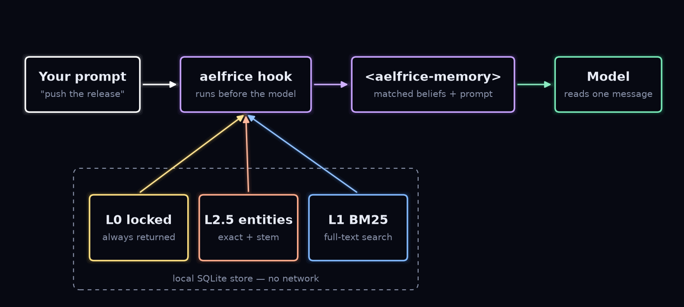

<p align="center"></p>

# aelfrice

[](https://pypi.org/project/aelfrice/)
[](https://pypi.org/project/aelfrice/)
[](LICENSE)
[](https://github.com/robotrocketscience/aelfrice/actions/workflows/ci.yml)
<!-- bench-canonical-badge:start -->
[](docs/design/v2_reproducibility_harness.md)
<!-- bench-canonical-badge:end -->

**aelfrice gives an AI coding agent a local, deterministic memory: what you teach it once arrives in every relevant prompt, before the model reads your message.**

- **Problem.** An agent forgets your corrections between sessions, and a rules file is advice the model can skip.
- **Method.** A prompt hook retrieves matching beliefs from a local SQLite store (your locked rules, an entity index, and BM25 full-text search) and puts them at the start of your prompt.
- **Evidence.** Every belief records where it came from and carries a Bayesian confidence that your feedback moves; a lock pins it as ground truth.
- **Scope.** Local only, with no cloud, account, or telemetry, and no embeddings or LLM in the retrieval path; turns and commits are captured while you work.

<p align="center"></p>

## Install

1. Install [uv](https://docs.astral.sh/uv/getting-started/installation/).
2. Install aelfrice:

   ```bash
   uv tool install aelfrice
   ```

3. Connect it to your agent. For the Codex CLI, add `--host codex`.

   ```bash
   aelf setup
   ```

4. In your agent, from your project directory, scan the project:

   ```text
   /aelf:onboard .
   ```

5. Lock your first rule:

   ```text
   /aelf:lock never push directly to main
   ```

From then on, aelfrice runs by itself. To check the install, run `/aelf:doctor`. The [installation guide](docs/user/INSTALL.md) covers every option.

<p align="center"></p>

## Commands

| Command | What it does | When to use it |
|---|---|---|
| `/aelf:lock <text>` | Locks a statement as ground truth that every relevant prompt carries. | You want a rule the agent never forgets. |
| `/aelf:search <query>` | Shows the beliefs a query retrieves, locked rules first. | You want to see what the agent will be told. |
| `/aelf:locked` | Lists your locked rules. | You want to review the rules in force. |
| `/aelf:onboard <path>` | Scans a project and stores what it learns. | You start using aelfrice on a project. |
| `/aelf:status` | Shows counts of beliefs, locks, and feedback. | You want a quick health summary. |
| `/aelf:doctor` | Checks the hooks and the store, and exits nonzero on a failure. | After setup, or when memory seems silent. |
| `/aelf:unlock <id>` | Removes the lock from a belief. | A rule no longer applies. |
| `/aelf:confirm <id>` | Raises a belief's confidence without locking it. | A belief proved right, but it isn't a rule. |
| `/aelf:review` | Writes a keep, remove, or lock checklist, then applies your verdicts. | Weekly cleanup. |
| `/aelf:retire <id>` | Removes a belief from retrieval, reversibly. | A belief is wrong or outdated. |
| `/aelf:wonder <topic>` | Researches a topic and stores the findings as speculative beliefs. | You want memory to fill a gap. |
| `/aelf:reason <query>` | Walks the belief graph and reports a verdict and suggested updates. | You want a structured answer from memory. |

<details>
<summary>The other 19 commands</summary>

| Command | What it does | When to use it |
|---|---|---|
| `/aelf:setup` | Installs the aelfrice hooks into your agent. | You install aelfrice, or repair its hooks. |
| `/aelf:show <id>` | Prints one belief in full with its origin and confidence. | You want the whole of one belief. |
| `/aelf:core` | Lists the load-bearing beliefs: locks, repeated ones, and high-confidence ones. | You want to see what anchors your memory. |
| `/aelf:feed` | Shows the log of belief writes. | You want to see what aelfrice recorded. |
| `/aelf:tail` | Streams what each prompt hook injected. | You want to watch injection live. |
| `/aelf:stale` | Lists old beliefs that haven't been retrieved recently. | Pruning memory that went cold. |
| `/aelf:restore <id>` | Brings a retired belief back. | You retired something by mistake. |
| `/aelf:delete <id>` | Deletes a belief permanently. | A belief must be gone for good. |
| `/aelf:promote <id>` | Marks an agent-inferred belief as validated by you. | You confirm what the agent worked out. |
| `/aelf:speculative` | Lists the unlocked, agent-inferred beliefs. | You want to audit what was inferred. |
| `/aelf:scope-out <text>` | Hides matching beliefs for the rest of this session. | A belief is noise for the task at hand. |
| `/aelf:category` | Groups rules and binds them to trigger keywords. | A set of rules applies to one kind of task. |
| `/aelf:graph <id>` | Emits the belief graph around a belief as DOT or JSON. | You want to visualize connections. |
| `/aelf:introspect` | Shows beliefs by session or project with their confidence and grounding. | You want to judge what was captured. |
| `/aelf:rebuild` | Prints the context block the rebuilder would restore. | You're debugging context after compaction. |
| `/aelf:audit-claude-memory` | Compares locked beliefs with your agent's own memory index. | You keep both and want them consistent. |
| `/aelf:eval` | Runs the relevance-calibration harness on a synthetic corpus. | You're measuring retrieval quality. |
| `/aelf:upgrade` | Upgrades aelfrice to the latest release. | A new version is out. |
| `/aelf:uninstall` | Removes aelfrice, and can archive the store first. | You stop using aelfrice. |

</details>

Each command has a terminal form, such as `aelf lock "..."`. The [command reference](docs/user/COMMANDS.md) documents all of them.

<p align="center"></p>

## Learn more

[Quickstart](docs/user/QUICKSTART.md) · [Architecture](docs/concepts/ARCHITECTURE.md) · [Configuration](docs/user/CONFIG.md) · [Philosophy](docs/concepts/PHILOSOPHY.md) · [Comparison](docs/concepts/COMPARISON.md) · [Privacy](docs/user/PRIVACY.md) · [Limitations](docs/user/LIMITATIONS.md) · [Changelog](CHANGELOG.md) · [Contributing](CONTRIBUTING.md)

[MIT license](LICENSE)
