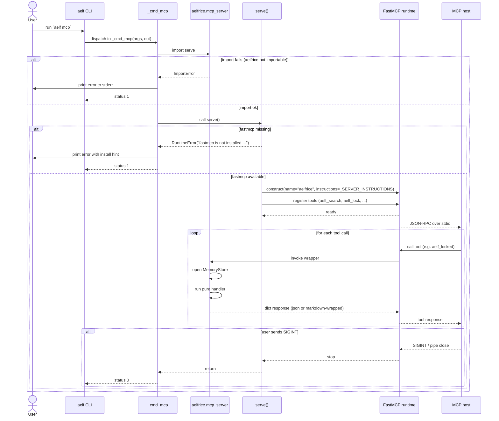
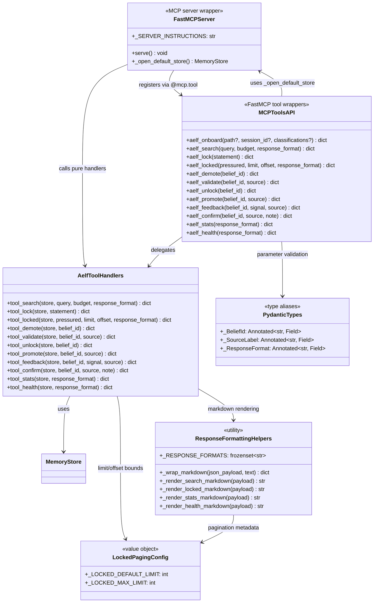

# MCP

aelfrice exposes twelve memory tools through a [Model Context Protocol](https://modelcontextprotocol.io) server. The agent calls them mid-turn; you don't have to invoke them yourself.

Lifecycle commands (`setup`, `unsetup`, `migrate`, `doctor`, `upgrade-cmd`, `uninstall`) are CLI-only.

## Install + run

The MCP server ships in every install of aelfrice, but the FastMCP runtime is gated behind the `[mcp]` extra:

```bash
# pip
pip install "aelfrice[mcp]"

# uv tool
uv tool install --with fastmcp aelfrice
```

Two equivalent ways to start the server (both speak stdio):

```bash
aelf mcp                           # console-script entry (preferred)
python -m aelfrice.mcp_server      # module-exec fallback
```

If `fastmcp` is missing, `aelf mcp` exits 1 with an actionable message (`error: fastmcp is not installed. Install with: pip install aelfrice[mcp]`) — no traceback, no half-started server.

Host config — any MCP-capable host:

```json
{
  "mcpServers": {
    "aelfrice": {
      "command": "aelf",
      "args": ["mcp"]
    }
  }
}
```

Working from a source checkout instead? Point the host at `uv` so it picks up the project's local interpreter:

```json
{
  "mcpServers": {
    "aelfrice": {
      "command": "uv",
      "args": ["run", "--project", "/abs/path/to/aelfrice", "aelf", "mcp"]
    }
  }
}
```

Tools register under the `aelf:` namespace.

## Tools

| Tool | Required | Optional | Returns |
|---|---|---|---|
| `aelf:onboard` | — | `path`, `session_id`, `classifications` | polymorphic — see below |
| `aelf:search` | `query` | `budget` (default 2,000) | `{kind, n_hits, hits[]}` |
| `aelf:lock` | `statement` | — | `{kind, id, action}` |
| `aelf:locked` | — | `pressured` | `{kind, n, locked[]}` |
| `aelf:demote` | `belief_id` | — | `{kind, id, demoted}` |
| `aelf:unlock` | `belief_id` | — | `{kind, id, unlocked, audit_event_id?}` |
| `aelf:validate` | `belief_id` | `source` (default `user_validated`) | `{kind, id, prior_origin, new_origin, audit_event_id?}` on success; `{kind: "validate.error", id, error}` on invalid request |
| `aelf:promote` | `belief_id` | `source` (default `user_validated`) | same union as `aelf:validate` |
| `aelf:feedback` | `belief_id`, `signal` | `source` | `{kind, id, signal, prior_alpha, new_alpha, prior_beta, new_beta, pressured_locks, demoted_locks}` |
| `aelf:confirm` | `belief_id` | `source` (default `user_confirmed`), `note` | `{kind, id, source, prior_alpha, new_alpha, prior_beta, new_beta, pressured_locks, demoted_locks, note?}` |
| `aelf:stats` | — | — | `{kind, beliefs, threads, locked, feedback_events, ...}` |
| `aelf:health` | — | — | `{kind, regime, description, classification_confidence?, features?}` |

`signal` is `"used"` or `"harmful"`. `aelf:unlock` drops a user-lock without touching origin and writes a `lock:unlock` audit row when a lock is actually removed; idempotent on already-unlocked beliefs (no row written). `aelf:promote` is a first-class alias of `aelf:validate` — identical semantics and return shape. Both `aelf:validate` and `aelf:promote` promote an `agent_inferred` belief to a user-validated origin tier (v1.2+).

`aelf:confirm` is a thin specialization of `aelf:feedback` that always applies a unit positive valence (+1.0). Use it when the model has independently verified a belief and wants to register that affirmation explicitly. The default `source` tag (`user_confirmed`) is distinct from the `used` source emitted by implicit retrieval feedback, so confirm events are queryable separately in the history table. The optional `note` field is a free-text annotation surfaced in the return payload only; it is not persisted.

```json
// Example
{"tool": "aelf:confirm", "belief_id": "abc123", "note": "verified against project docs"}
// Returns
{"kind": "confirm.applied", "id": "abc123", "source": "user_confirmed",
 "prior_alpha": 1.0, "new_alpha": 2.0, "prior_beta": 1.0, "new_beta": 1.0,
 "pressured_locks": [], "demoted_locks": [], "note": "verified against project docs"}
```

## `aelf:onboard` polymorphism

Three input shapes, dispatched by which fields the caller supplied:

| Input | Phase | Returns |
|---|---|---|
| `{path}` | start | `{kind: "onboard.session_started", session_id, sentences[]}` for the host LLM to classify |
| `{session_id, classifications}` | finish | `{kind: "onboard.session_completed", inserted, skipped_*}` |
| `{}` | status | `{kind: "onboard.status", n_pending, pending_session_ids}` |

Unlike the CLI's synchronous regex `scan_repo`, the MCP onboard uses the host LLM for higher-quality classification.

## Pure handlers

Every tool is a pure function `(store, **kwargs) -> dict`. You can call them in tests without `fastmcp`:

```python
from aelfrice.store import MemoryStore
from aelfrice.mcp_server import tool_confirm, tool_search, tool_lock

store = MemoryStore(":memory:")
tool_lock(store, statement="never push directly to main")
tool_search(store, query="push", budget=500)
tool_confirm(store, belief_id="<id>", note="spot-checked correct")
```

## Architecture

The server is a thin `FastMCP` shell over twelve pure handlers. Each `aelf_*` wrapper opens a default `MemoryStore`, delegates to the matching `tool_*` handler, and returns the handler's `dict` — formatted as JSON or markdown depending on the caller's `response_format` choice.

### `aelf mcp` startup + tool dispatch



### Wrapper / handler layering



Source: `src/aelfrice/mcp_server.py`. Diagrams generated by Sourcery for PR #512 — the `aelf mcp` CLI entrypoint, `_SERVER_INSTRUCTIONS`, response-format helpers, locked-pagination, and Pydantic-typed wrappers all land with that PR.

## Backward compatibility

`aelf:stats` and `aelf:health` still emit both the v1.0 schema names (`edges`, `edge_per_belief`) and the v1.1.0 user-facing names (`threads`, `thread_per_belief`) with the same integer value. The v1.2.0 removal slated in earlier docs has not landed — both forms are emitted as of v2.0.0. Prefer `threads` / `thread_per_belief` in new code; legacy clients on `edges` continue to work.
