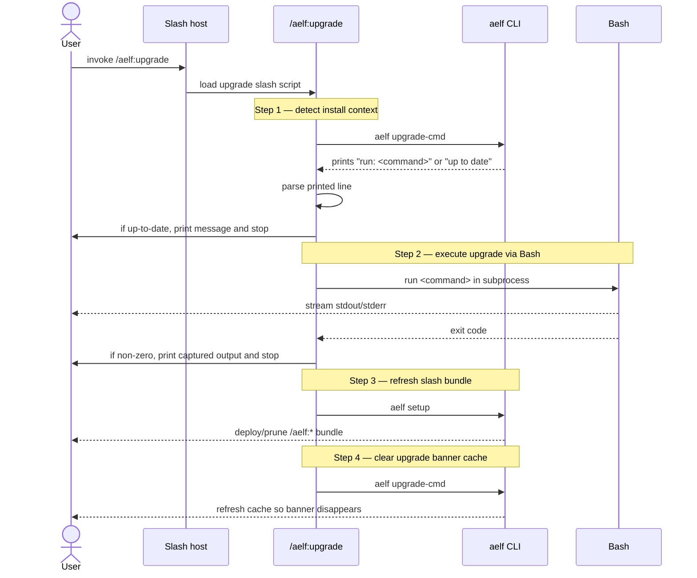
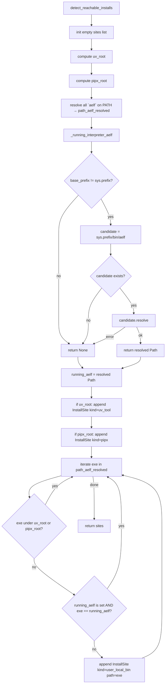

# Slash Commands

Eighteen markdown files in `src/aelfrice/slash_commands/`, tracking the v1.2.0 CLI consolidation plus the v1.4.0 `rebuild` promotion and the v2.0 reasoning surfaces. After `aelf setup`, they appear as `/aelf:*` in the host. Each is a thin wrapper over the CLI — `/aelf:foo` invokes `aelf foo` against the active project's DB.

Slash files are not shipped for hidden CLI subcommands (`bench`, `feedback`, `health`, `migrate`, `project-warm`, `regime`, `session-delta`, `stats`, `statusline`, `unsetup`). Those subcommands stay callable from the CLI for scripting, hook entry-points, and back-compat aliases — they're just not surfaced as slashes.

`aelf setup` installs all slash-command files automatically into `~/.claude/commands/aelf/` and prunes any stale files left behind by renames (e.g. `stats.md` after the v1.2.0 rename to `status.md`). Re-running `aelf setup` after an upgrade is sufficient to keep the set current.

## Reference

| Slash | Argument hint |
|---|---|
| `/aelf:onboard` | path to project dir |
| `/aelf:search` | keyword query |
| `/aelf:lock` | statement to lock |
| `/aelf:unlock` | belief id — drops the lock without changing origin tier |
| `/aelf:locked` | optional `--pressured` |
| `/aelf:confirm` | belief id — bumps posterior without freezing |
| `/aelf:promote` | belief id — promote `agent_inferred` to `user_validated` |
| `/aelf:delete` | belief id (locked beliefs require `--force`; `--yes` skips prompt) |
| `/aelf:core` | optional `--json`, `--locked-only` — surfaces load-bearing beliefs |
| `/aelf:status` | (none) — belief / lock / history counts (renamed from `stats` at v1.2.0) |
| `/aelf:doctor` | optional `[hooks\|graph]`, `--user-settings`, `--project-root` |
| `/aelf:tail` | optional `--filter`, `--since`, `--no-follow` — live-tail the hook injection audit log |
| `/aelf:setup` | optional `--scope`, `--command`, `--transcript-ingest`, etc. |
| `/aelf:upgrade` | (none) — imperative upgrade. Detects install context, runs `uv tool upgrade aelfrice` (or pipx/pip equivalent) in Bash (separate process, no mid-process interpreter replacement), then `aelf setup` to refresh the slash-command bundle, then clears the stale update-banner cache. The advisory `aelf upgrade-cmd` CLI verb still exists for scripted use. |
| `/aelf:uninstall` | one of `--keep-db`, `--archive`, `--purge` |
| `/aelf:rebuild` | optional `--n N`, `--budget T`, `--transcript PATH` — manually fire the context rebuilder; v1.4.0+ |
| `/aelf:reason` | keyword query — walks the belief graph from BM25-seeded starting points; v2.0+ (#389) |
| `/aelf:wonder` | optional flags (`--top N`, `--seed ID`, `--emit-phantoms`) — surfaces consolidation candidates / phantom-belief suggestions; v2.0+ (#389), phantom-store integration deferred to v2.x |

Behaviour matches the CLI exactly — see [COMMANDS](COMMANDS.md). The v1.1.0 `edges` → `threads` user-facing rename does not surface here; the program name remains `aelf`.

## Pick a surface

| Caller | Use |
|---|---|
| You, in Claude Code | `/aelf:*` slash command |
| The agent, mid-turn | `aelf:*` MCP tool — see [MCP](MCP.md) |
| Shell or script | `aelf` CLI — see [COMMANDS](COMMANDS.md) |
| Tests / embedded | `tool_*` handlers from `aelfrice.mcp_server` |

Remove with `rm -rf ~/.claude/commands/aelf/` plus `aelf unsetup`. The two are independent registrations.

## `/aelf:upgrade` orchestrator flow

The `upgrade` slash file is the only `/aelf:*` command that does not pass straight through to a single CLI verb. It orchestrates four steps in sequence; the underlying upgrade itself runs in a Bash subprocess separate from the running `aelf` interpreter, so there is no mid-process interpreter replacement to worry about.

## `detect_reachable_installs()` — running-venv suppression

Exposes every `aelf` install on the user's PATH, suppressing the venv that hosts the running interpreter (otherwise `uv run` produces a spurious "multiple installs detected" warning when there's actually only one persistent install on the user's shell PATH).

Source: `src/aelfrice/lifecycle.py`. Diagrams generated by Sourcery for PR #513.
