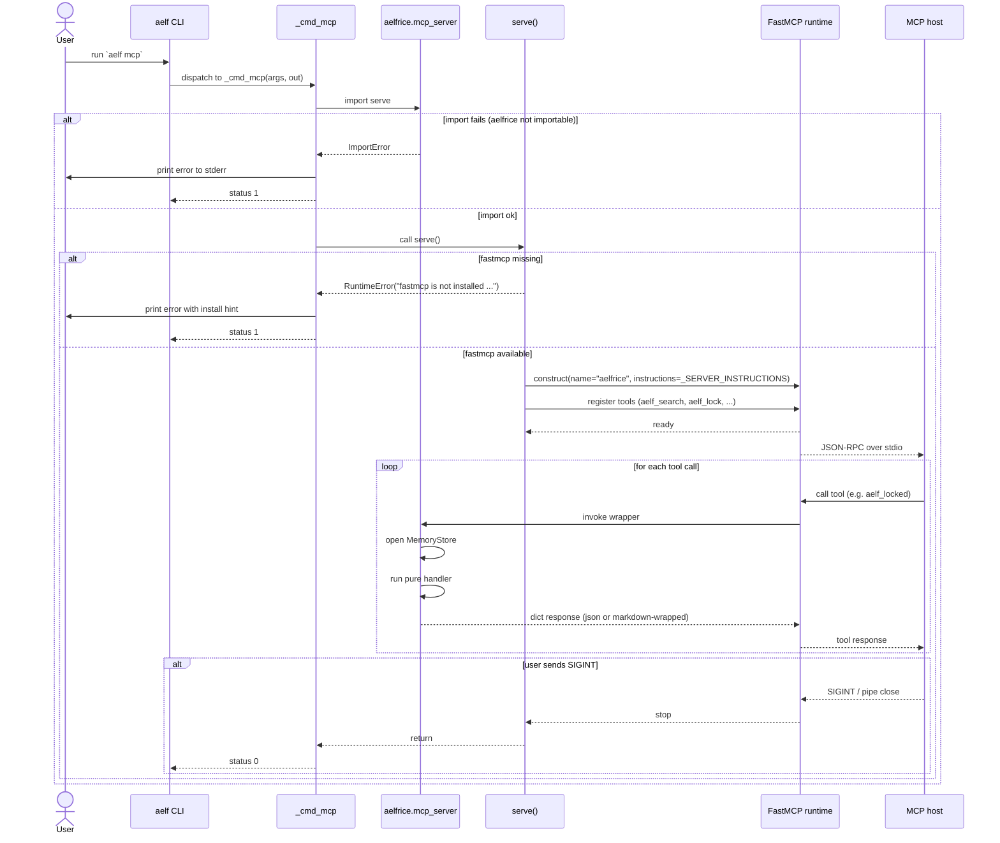
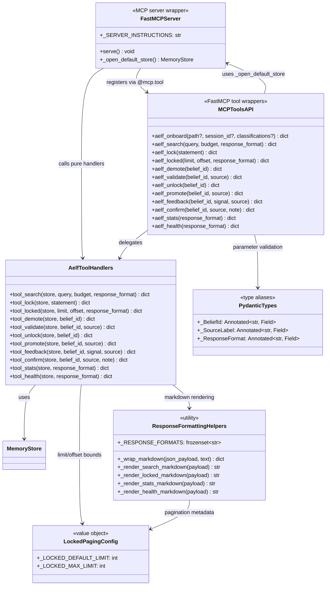

# MCP

aelfrice exposes fifteen memory tools through a [Model Context Protocol](https://modelcontextprotocol.io) server. The agent calls them mid-turn; you don't have to invoke them yourself.

Lifecycle commands (`setup`, `unsetup`, `migrate`, `doctor`, `upgrade-cmd`, `uninstall`) are not exposed as MCP tools — most have `/aelf:*` slash forms instead (see [SLASH_COMMANDS](SLASH_COMMANDS.md)); only `migrate`, `unsetup`, and `mcp` itself are CLI-only.

## Install + run

The MCP server ships in every install of aelfrice, but the FastMCP runtime is gated behind the `[mcp]` extra:

```bash
uv tool install "aelfrice[mcp]"          # extra-syntax
uv tool install --with fastmcp aelfrice  # equivalent --with form
```

aelfrice is uv-only as of v3.0.1 ([#730](https://github.com/robotrocketscience/aelfrice/issues/730)).

Two equivalent ways to start the server (both speak stdio):

```bash
aelf mcp                           # console-script entry (preferred)
python -m aelfrice.mcp_server      # module-exec fallback
```

If `fastmcp` is missing, `aelf mcp` exits 1 with an actionable message (`error: fastmcp is not installed. Install with: uv tool install "aelfrice[mcp]"`) — no traceback, no half-started server.

Host config — any MCP-capable host:

```json
{
  "mcpServers": {
    "aelfrice": {
      "command": "aelf",
      "args": ["mcp"]
    }
  }
}
```

Working from a source checkout instead? Point the host at `uv` so it picks up the project's local interpreter:

```json
{
  "mcpServers": {
    "aelfrice": {
      "command": "uv",
      "args": ["run", "--project", "/abs/path/to/aelfrice", "aelf", "mcp"]
    }
  }
}
```

Tools register under the `aelf:` namespace. On the wire the registered tool names use an underscore — `aelf_search`, `aelf_confirm`, ... — `aelf:` is display shorthand throughout this doc.

## Tools

| Tool | Required | Optional | Returns |
|---|---|---|---|
| `aelf:onboard` | — | `path`, `session_id`, `classifications` | polymorphic — see below |
| `aelf:search` | `query` | `budget` (default 2,400), `response_format` (default `json`) | `{kind, n_hits, hits[]}` |
| `aelf:lock` | `statement` | — | `{kind, id, action}` |
| `aelf:locked` | — | `limit`, `offset`, `response_format` | `{kind, n, total, next_offset, locked[]}` |
| `aelf:demote` | `belief_id` | `to_scope` (v3.0+, [#689](https://github.com/robotrocketscience/aelfrice/issues/689)) | `{kind, id, demoted}`; with `to_scope` set, the call performs only the scope flip (no tier demotion) — it flips federation visibility, writes a `scope:<old>-><new>` audit row, and returns `{kind: "scope.updated", id, scope_updated, prior_scope, new_scope, audit_event_id}`. |
| `aelf:unlock` | `belief_id` | — | `{kind, id, unlocked, audit_event_id?}` |
| `aelf:validate` | `belief_id` | `source` (default `user_validated`) | `{kind, id, prior_origin, new_origin, audit_event_id?}` on success; `{kind: "validate.error", id, error}` on invalid request |
| `aelf:promote` | `belief_id` | `source` (default `user_validated`), `to_scope` (v3.0+) | same union as `aelf:validate`; with `to_scope` set, the payload includes an additional `scope` key with the scope-change result |
| `aelf:feedback` | `belief_id`, `signal` | `source` | `{kind, id, signal, prior_alpha, new_alpha, prior_beta, new_beta}` |
| `aelf:confirm` | `belief_id` | `source` (default `user_confirmed`), `note` | `{kind, id, source, prior_alpha, new_alpha, prior_beta, new_beta, note?}` |
| `aelf:stats` | — | `response_format` (default `json`) | `{kind, beliefs, threads, locked, feedback_events, ...}` |
| `aelf:health` | — | `response_format` (default `json`) | `{kind, regime, description, classification_confidence?, features?}` |
| `aelf:wonder` | `query` | `budget` (default 24), `depth` (default 2), `agent_count` (default 4) | `{kind: "wonder.axes", gap_analysis, research_axes, agent_count, speculative_anchor_ids}` — v3.0+ (#551). The no-query graph-walk consolidation mode is CLI-only (`aelf wonder` with no positional query); the MCP tool always requires `query`. |
| `aelf:wonder_persist` | `query` (ignored in BFS mode — kept for API symmetry with `aelf:wonder`) | `budget` (default 24), `depth` (default 2), `top` (default 10), `seed` (explicit seed belief ID; default = highest-degree non-locked belief) | `{kind, inserted, skipped, edges_created}` — runs `wonder_ingest` against BFS phantom candidates. `destructiveHint: true`. v3.0+ (#549). |
| `aelf:wonder_gc` | — | `ttl_days` (default 14), `dry_run` (default `false` — pass `dry_run=true` to preview candidates without mutating the store) | `{kind, scanned, deleted, surviving}` (`deleted` is 0 when `dry_run=true`) — runs the `wonder_gc` lifecycle sweep. `destructiveHint: true`. v3.0+ (#549). |

`signal` is `"used"` or `"harmful"`. `aelf:unlock` drops a user-lock without touching origin and writes a `lock:unlock` audit row when a lock is actually removed; idempotent on already-unlocked beliefs (no row written). `aelf:promote` is an alias of `aelf:validate` for the promotion semantics and return shape; unlike `aelf:validate`, it additionally accepts `to_scope` for federation scope moves. Both `aelf:validate` and `aelf:promote` promote an `agent_inferred` belief to a user-validated origin tier (v1.2+).

`aelf:confirm` is a thin specialization of `aelf:feedback` that always applies a unit positive valence (+1.0). Use it when the model has independently verified a belief and wants to register that affirmation explicitly. The default `source` tag (`user_confirmed`) is distinct from the `hook` source written by implicit retrieval feedback (and from the default `user` source on explicit `aelf:feedback` calls), so confirm events are queryable separately in the history table. The optional `note` field is a free-text annotation surfaced in the return payload only; it is not persisted.

```json
// Example
{"tool": "aelf_confirm", "belief_id": "abc123", "note": "verified against project docs"}
// Returns
{"kind": "confirm.applied", "id": "abc123", "source": "user_confirmed",
 "prior_alpha": 1.0, "new_alpha": 2.0, "prior_beta": 1.0, "new_beta": 1.0,
 "note": "verified against project docs"}
```

## `aelf:onboard` polymorphism

Three input shapes, dispatched by which fields the caller supplied:

| Input | Phase | Returns |
|---|---|---|
| `{path}` | start | `{kind: "onboard.session_started", session_id, sentences[]}` for the host LLM to classify |
| `{session_id, classifications}` | finish | `{kind: "onboard.session_completed", inserted, skipped_*}` |
| `{}` | status | `{kind: "onboard.status", n_pending, pending_session_ids}` |

Unlike the CLI's synchronous regex `scan_repo`, the MCP onboard uses the host LLM for higher-quality classification.

## Pure handlers

Every tool is a pure function `(store, **kwargs) -> dict`. You can call them in tests without `fastmcp`:

```python
from aelfrice.store import MemoryStore
from aelfrice.mcp_server import tool_confirm, tool_search, tool_lock

store = MemoryStore(":memory:")
tool_lock(store, statement="never push directly to main")
tool_search(store, query="push", budget=500)
tool_confirm(store, belief_id="<id>", note="spot-checked correct")
```

## Architecture

The server is a thin `FastMCP` shell over fifteen pure handlers. Each `aelf_*` wrapper opens a default `MemoryStore`, delegates to the matching `tool_*` handler, and returns the handler's `dict` — formatted as JSON or markdown depending on the caller's `response_format` choice.

### `aelf mcp` startup + tool dispatch



### Wrapper / handler layering



Source: `src/aelfrice/mcp_server.py`. Diagrams generated by Sourcery for PR #512 — the `aelf mcp` CLI entrypoint, `_SERVER_INSTRUCTIONS`, response-format helpers, locked-pagination, and Pydantic-typed wrappers all land with that PR. The diagrams enumerate the v2.0 12-tool surface; the three v3.0 additions (`aelf_wonder` from #551, `aelf_wonder_persist` and `aelf_wonder_gc` from #549) follow the same wrapper-delegates-to-pure-handler pattern and are listed in the Tools table above.

## Backward compatibility

`aelf:stats` and `aelf:health` still emit both the v1.0 schema names (`edges`, `edge_per_belief`) and the v1.1.0 user-facing names (`threads`, `thread_per_belief`) with the same integer value — confirmed in `mcp_server.py:814-815` as of v3.8. The originally-planned v1.2.0 drop did not happen and is no longer scheduled; both forms remain emitted indefinitely. Prefer `threads` / `thread_per_belief` in new code; legacy clients on `edges` continue to work.
