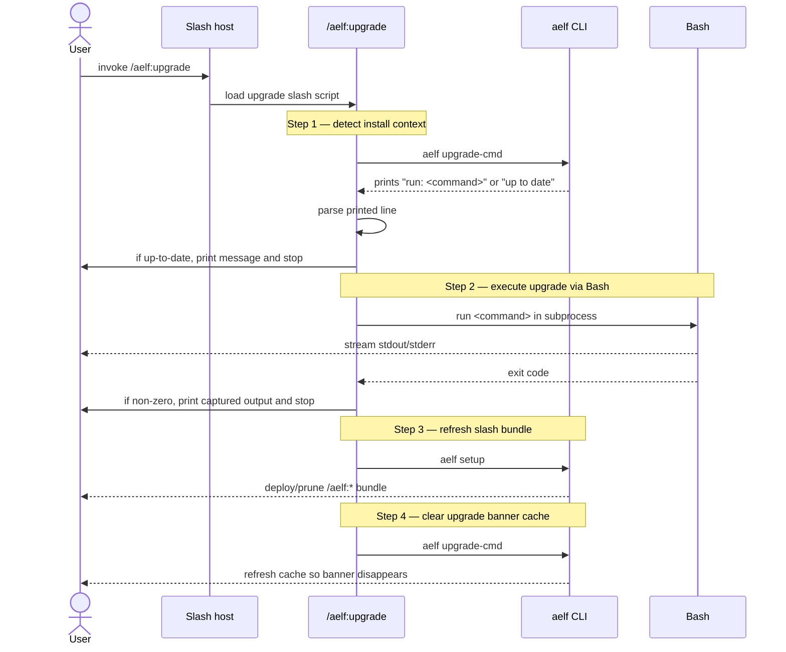
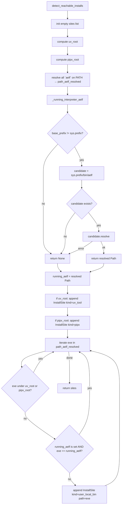

# Slash commands

Twenty-nine markdown files in `src/aelfrice/slash_commands/`, tracking the v1.2.0 CLI consolidation, the v1.4.0 `rebuild` promotion, the v2.0 reasoning surfaces, the v2.x `eval` calibration surface, the v3.3.0 `/aelf:graph` viz (#629), the v3.3.0 `/aelf:scope-out` session-scoped retrieval exclusion (#856), the v3.5 belief-hygiene additions (`/aelf:feed`, `/aelf:stale`, `/aelf:review`, `/aelf:speculative`, `/aelf:audit-claude-memory`), and the v4.0 belief-curation additions (`/aelf:introspect`, `/aelf:retire`, `/aelf:restore`, #1081). After `aelf setup`, they appear as `/aelf:*` in the host. Each is a thin wrapper over the CLI — `/aelf:foo` invokes `aelf foo` against the active project's DB.

Slash files cover the everyday user-facing surface, plus a handful of operator workflows where one keystroke matters (`/aelf:uninstall`, `/aelf:upgrade`). Hidden CLI subcommands (`bench`, `cadence-score`, `clamp-ghosts`, `demote`, `export-canvas`, `feedback`, `gate`, `health`, `ingest-transcript`, `label`, `project-warm`, `regime`, `resolve`, `session-delta`, `spine`, `stats`, `statusline`, `unsetup`, `upgrade-cmd`, `validate`) and the per-hook entry points stay callable from the CLI for scripting and back-compat — they're not surfaced as slashes. The visible CLI verbs `migrate`, `mcp`, `sweep-feedback`, and `scan-derivation` are likewise CLI-only because they're operator / scripting flows rather than per-turn agent surface.

`aelf setup` installs all slash-command files automatically into `~/.claude/commands/aelf/` and prunes any stale files left behind by renames (e.g. `stats.md` after the v1.2.0 rename to `status.md`). Re-running `aelf setup` after an upgrade is sufficient to keep the set current.

## Reference

| Slash | Argument hint |
|---|---|
| `/aelf:onboard` | path to project dir |
| `/aelf:search` | keyword query |
| `/aelf:lock` | statement to lock |
| `/aelf:unlock` | belief id — drops the lock without changing origin tier |
| `/aelf:locked` | (none) |
| `/aelf:confirm` | belief id — bumps posterior without freezing |
| `/aelf:promote` | belief id — promote `agent_inferred` to `user_validated`. v3.0+ accepts `--to-scope SCOPE` to flip federation visibility in the same call (#689). |
| `/aelf:delete` | belief id (locked beliefs require `--force`; `--yes` skips prompt) |
| `/aelf:core` | optional `--json`, `--locked-only` — surfaces load-bearing beliefs |
| `/aelf:status` | (none) — belief / lock / history counts (renamed from `stats` at v1.2.0) |
| `/aelf:doctor` | optional `[hooks\|graph]`, `--user-settings`, `--project-root` |
| `/aelf:tail` | optional `--filter`, `--since`, `--no-follow` — live-tail the hook injection audit log |
| `/aelf:setup` | optional `--scope`, `--command`, `--transcript-ingest`, etc. |
| `/aelf:upgrade` | (none) — imperative upgrade. Detects install context, runs `uv tool upgrade aelfrice` (or, for legacy pipx/pip installs, the uninstall-and-migrate-to-uv command per #730) in Bash (separate process, no mid-process interpreter replacement), then `aelf setup` to refresh the slash-command bundle, then clears the stale update-banner cache. The advisory `aelf upgrade-cmd` CLI verb still exists for scripted use. |
| `/aelf:uninstall` | one of `--keep-db`, `--archive`, `--purge` |
| `/aelf:rebuild` | optional `--n N`, `--budget T`, `--transcript PATH` — manually fire the context rebuilder; v1.4.0+ |
| `/aelf:reason` | keyword query — v2.0+ (#389) walks the belief graph from BM25-seeded starting points; v3.0+ ([#645](https://github.com/robotrocketscience/aelfrice/issues/645) R3, [#690](https://github.com/robotrocketscience/aelfrice/issues/690), [#713](https://github.com/robotrocketscience/aelfrice/issues/713)) expands into a three-step orchestrator: (1) run `aelf reason --json` and print the chain; (2) fan out one Task subagent per `payload.dispatch[i]` with a role-tagged prompt (Verifier / Gap-filler / Fork-resolver derived from VERDICT + ImpasseKind); (3) print a `SUGGESTED UPDATES` section that maps `payload.suggested_updates[*]` to `aelf feedback` close-the-loop directions. Peer hops in foreign scopes are annotated `[scope:<name>]`. |
| `/aelf:wonder` | two modes (v3.0+, [#542](https://github.com/robotrocketscience/aelfrice/issues/542) / [#552](https://github.com/robotrocketscience/aelfrice/issues/552)). **No-arg / `--seed`** runs the v2.0 graph-walk consolidation (`--top N`, `--emit-phantoms`). **Positional `QUERY`** (or the deprecated `--axes QUERY` alias) runs `aelf wonder "QUERY"`, has the host agent fan out one research task per axis with the axis name + search hints + gap context, collects each task's research document into a JSONL file with `{axis_name, content, anchor_ids}` rows, and hands the file to `aelf wonder --persist-docs FILE` which materialises one phantom per axis via `wonder_ingest`. Agent-count shorthand `quick N-agent` / `deep N-agent` recognised. Phantom-store integration shipped at v3.0; pre-v3 the slash only emitted candidates. |
| `/aelf:eval` | optional `--corpus PATH`, `--k N`, `--seed N`, `--json` — runs the relevance-calibration harness (P@K / ROC-AUC / Spearman ρ) ratified at #365 |
| `/aelf:graph` | positional `belief-id-or-keyword` (BM25-resolvable anchor; omit when using `--seed-id`), repeatable `--seed-id ID`, `--hops N` (default 2), `--format dot\|json`, `--preview-chars N` (default 80) — emits a subgraph with color-coded edges (all 11 edge types — legend in `aelf graph --help`) and nodes shaded by lock status and posterior bucket (locked cyan, high-posterior green, low-posterior red). v3.3+ ([#629](https://github.com/robotrocketscience/aelfrice/issues/629)). |
| `/aelf:scope-out` | `pattern` (positional) or `--list` / `--clear` — suppress beliefs whose content contains a case-insensitive substring from this session's hook retrieval; auto-clears when a new session starts. (Federation visibility is `aelf promote`/`aelf demote --to-scope`, not this.) v3.3+ ([#856](https://github.com/robotrocketscience/aelfrice/issues/856)). |
| `/aelf:feed` | optional `--limit N`, `--since DUR` (5m / 2h / 1d), `--json` — read the belief-write event log at `<git-common-dir>/aelfrice/feed.jsonl` (lock / onboard / wonder-promote / feedback rows). v3.5+. |
| `/aelf:stale` | `--older-than DAYS`, `--cold-for DAYS` — list beliefs with `created_at` older than N days AND `last_retrieved_at` NULL or older than M days. No decay model; thresholds are plain windows (defaults: 30 days old, 14 days cold). v3.5+. |
| `/aelf:review` | single invocation runs the full cycle: `aelf review --generate` writes `.aelfrice/review.md` with up to 10 oldest-unconfirmed beliefs as a checkbox file, the slash pauses while you edit verdicts, then (after you confirm) runs `aelf review --apply` in the same flow to apply keep / remove / lock decisions. v3.5+ ([#936](https://github.com/robotrocketscience/aelfrice/issues/936)). |
| `/aelf:speculative` | optional `--origin TAG`, `--limit N`, `--json` — list non-user-locked (L1) beliefs sorted by α descending: the agent-inferred / ingested / wonder-generated layer. v3.5+ ([#937](https://github.com/robotrocketscience/aelfrice/issues/937)). |
| `/aelf:audit-claude-memory` | optional `--project PATH`, `--json` — read-only cross-store dedup audit between locked aelfrice beliefs and the host's `~/.claude/projects/.../memory/MEMORY.md`. Reports potential duplicates, contradictions, and store-exclusive entries. v3.5+ ([#935](https://github.com/robotrocketscience/aelfrice/issues/935)). |
| `/aelf:introspect` | optional `--by session\|project`, `--session ID`, `--project CTX`, `--only-noise`, `--limit N`, `--json` — read-only honest-signal view over active beliefs, grouped by session/project, surfacing posterior μ, recurrence, grounding, floated-vs-decided status, and stranded-capture noise together. `--only-noise` is the retire shortlist. v4.0+ ([#1081](https://github.com/robotrocketscience/aelfrice/issues/1081)). |
| `/aelf:retire` | belief id (locked beliefs require `--force`) — reversible soft-delete: drops the belief from retrieval/search while preserving its evidence trail. Undo with `/aelf:restore`. v4.0+ ([#1081](https://github.com/robotrocketscience/aelfrice/issues/1081)). |
| `/aelf:restore` | belief id — inverse of `/aelf:retire`: clears `valid_to` and re-indexes the belief for search. No-op on an already-active or unknown id. v4.0+ ([#1081](https://github.com/robotrocketscience/aelfrice/issues/1081)). |

Behaviour matches the CLI exactly — see [COMMANDS](COMMANDS.md). The v1.1.0 `edges` → `threads` user-facing rename does not surface here; the program name remains `aelf`.

## Pick a surface

| Caller | Use |
|---|---|
| You, in Claude Code | `/aelf:*` slash command |
| The agent, mid-turn | `aelf:*` MCP tool — see [MCP](MCP.md) |
| Shell or script | `aelf` CLI — see [COMMANDS](COMMANDS.md) |
| Tests / embedded | `tool_*` handlers from `aelfrice.mcp_server` |

Remove with `aelf unsetup` — it strips the hooks from settings.json and deletes the bundled files under `~/.claude/commands/aelf/` in one pass.

## `/aelf:upgrade` orchestrator flow

The `upgrade` slash file is the only `/aelf:*` command that does not pass straight through to a single CLI verb. It orchestrates four steps in sequence; the underlying upgrade itself runs in a Bash subprocess separate from the running `aelf` interpreter, so there is no mid-process interpreter replacement to worry about.

## `detect_reachable_installs()` — running-venv suppression

Exposes every `aelf` install on the user's PATH, suppressing the venv that hosts the running interpreter (otherwise `uv run` produces a spurious "multiple installs detected" warning when there's actually only one persistent install on the user's shell PATH).

Source: `src/aelfrice/lifecycle.py`. Diagrams generated by Sourcery for PR #513.
