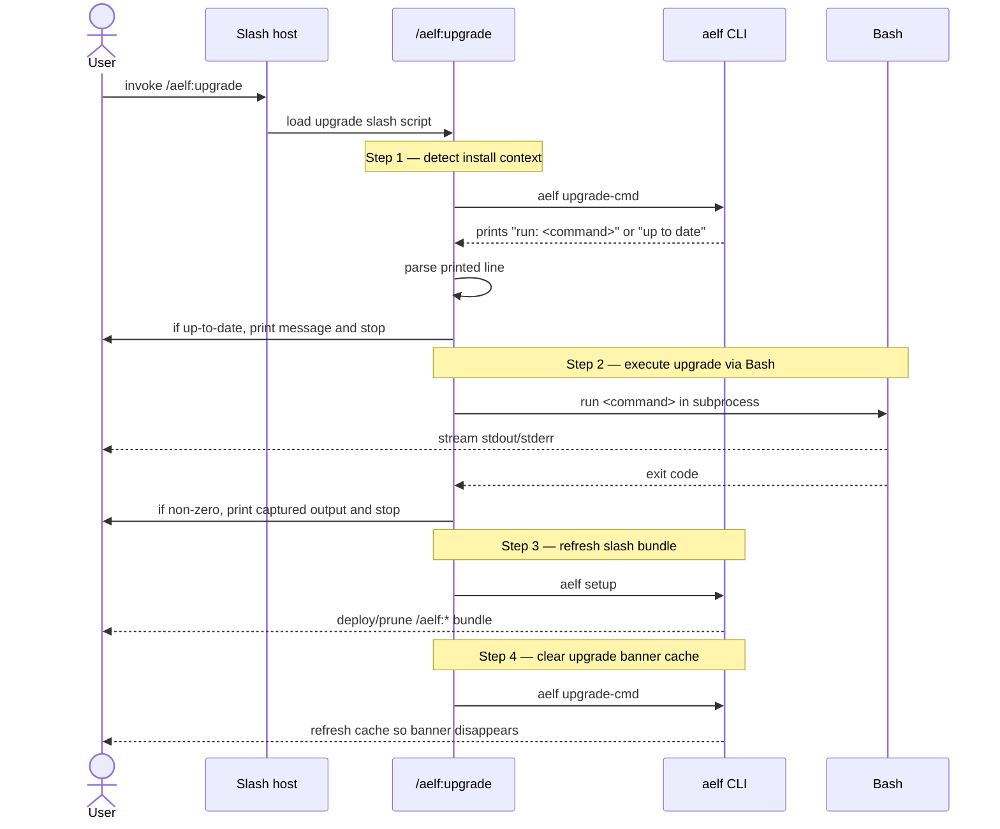
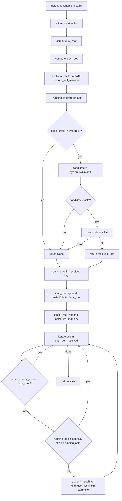

# Slash commands

`src/aelfrice/slash_commands/` holds thirty markdown files. They track the v1.2.0 CLI consolidation and the v1.4.0 `rebuild` promotion. They track the v2.0 reasoning surfaces and the v2.x `eval` calibration surface. They track the v3.3.0 `/aelf:graph` visualization (#629) and the v3.3.0 `/aelf:scope-out` session-scoped retrieval exclusion (#856). They track the v3.5 belief-hygiene additions (`/aelf:feed`, `/aelf:stale`, `/aelf:review`, `/aelf:speculative`, `/aelf:audit-claude-memory`). They track the v4.0 belief-curation additions (`/aelf:introspect`, `/aelf:retire`, `/aelf:restore`, #1081). They track the v4.x `/aelf:category` keyword-triggered categories (#1126). After `aelf setup`, the files appear as `/aelf:*` in the host. Each file is a thin wrapper over the CLI. `/aelf:foo` invokes `aelf foo` against the active project's DB.

The slash files cover the everyday user-facing surface. They also cover a few operator workflows where one keystroke matters (`/aelf:uninstall`, `/aelf:upgrade`). The hidden subcommands include `bench`, `cadence-score`, `clamp-ghosts`, `demote`, `export-canvas`, `feedback`, `gate`, `health`, `ingest-transcript`, `label`, `project-warm`, `regime`, `resolve`, `session-delta`, `spine`, `stats`, `statusline`, `unsetup`, `upgrade-cmd` and `validate`. The hidden subcommands and the per-hook entry points stay callable from the CLI for scripting and for back-compatibility. Neither group is surfaced as a slash command.

The visible CLI verbs `migrate`, `sweep-feedback` and `scan-derivation` are likewise CLI-only. They are operator flows and scripting flows, not a per-turn agent surface.

`aelf setup` installs all the slash-command files automatically into `~/.claude/commands/aelf/`. It also prunes any stale file that a rename left behind. One example is `stats.md`, after the v1.2.0 rename to `status.md`. To keep the set current after an upgrade, run `aelf setup` again. No other step is necessary.

## Reference

| Slash | Argument hint |
|---|---|
| `/aelf:onboard` | the path to the project directory |
| `/aelf:search` | a keyword query |
| `/aelf:lock` | the statement to lock |
| `/aelf:unlock` | a belief id. The command drops the lock. It does not change the origin tier. |
| `/aelf:locked` | (none) |
| `/aelf:confirm` | a belief id. The command bumps the posterior. It does not freeze the belief. |
| `/aelf:promote` | a belief id. The command promotes `agent_inferred` to `user_validated`. From v3.0 it accepts `--to-scope SCOPE`, which flips the federation visibility in the same call (#689). |
| `/aelf:delete` | a belief id. A locked belief requires `--force`. `--yes` skips the prompt. |
| `/aelf:core` | optional `--json` and `--locked-only`. The command surfaces the load-bearing beliefs. |
| `/aelf:status` | (none). The command prints the belief count, the lock count and the history count. It was renamed from `stats` at v1.2.0. |
| `/aelf:doctor` | optional `[hooks\|graph]`, `--user-settings`, `--project-root` |
| `/aelf:tail` | optional `--filter`, `--since` and `--no-follow`. The command live-tails the audit log for hook injection. |
| `/aelf:setup` | optional `--scope`, `--command`, `--transcript-ingest`, and others |
| `/aelf:upgrade` | (none). The command performs the upgrade itself. First it detects the install context. Then it runs `uv tool upgrade aelfrice` in Bash. For a legacy pipx install or pip install, it runs the uninstall-and-migrate-to-uv command instead, per #730. Bash is a separate process, so there is no mid-process interpreter replacement. Then it runs `aelf setup` to refresh the slash-command bundle. Then it clears the stale update-banner cache. The advisory `aelf upgrade-cmd` CLI verb still exists for scripted use. |
| `/aelf:uninstall` | one of `--keep-db`, `--archive`, `--purge` |
| `/aelf:rebuild` | optional `--n N`, `--budget T` and `--transcript PATH`. The command fires the context rebuilder manually. v1.4.0+ |
| `/aelf:reason` | keyword query — v2.0+ (#389) walks the belief graph from BM25-seeded starting points; v3.0+ ([#645](https://github.com/robotrocketscience/aelfrice/issues/645) R3, [#690](https://github.com/robotrocketscience/aelfrice/issues/690), [#713](https://github.com/robotrocketscience/aelfrice/issues/713)) expands into a three-step orchestrator: (1) run `aelf reason --json` and print the chain; (2) fan out one Task subagent per `payload.dispatch[i]` with a role-tagged prompt (Verifier / Gap-filler / Fork-resolver derived from VERDICT + ImpasseKind); (3) print a `SUGGESTED UPDATES` section that maps `payload.suggested_updates[*]` to `aelf feedback` close-the-loop directions. Peer hops in foreign scopes are annotated `[scope:<name>]`. |
| `/aelf:wonder` | two modes (v3.0+, [#542](https://github.com/robotrocketscience/aelfrice/issues/542) / [#552](https://github.com/robotrocketscience/aelfrice/issues/552)). **No-argument mode, or `--seed`**, runs the v2.0 graph-walk consolidation (`--top N`, `--emit-phantoms`). **The positional `QUERY`**, or the deprecated `--axes QUERY` alias, runs `aelf wonder "QUERY"`. The host agent then fans out one research task per axis, with the axis name, the search hints and the gap context. It collects the research document of each task into a JSONL file with `{axis_name, content, anchor_ids}` rows. It hands the file to `aelf wonder --persist-docs FILE`, which materialises one phantom per axis through `wonder_ingest`. The command recognises the agent-count shorthand `quick N-agent` / `deep N-agent`. The phantom-store integration shipped at v3.0. Before v3, the slash command only emitted candidates. |
| `/aelf:eval` | optional `--corpus PATH`, `--k N`, `--seed N` and `--json`. The command runs the relevance-calibration harness (P@K / ROC-AUC / Spearman ρ) ratified at #365. |
| `/aelf:graph` | the positional `belief-id-or-keyword`, which is an anchor that Best Matching 25 (BM25) can resolve. Omit it when you use `--seed-id`. The other arguments are the repeatable `--seed-id ID`, `--hops N` (default 2), `--format dot\|json`, and `--preview-chars N` (default 80). The command emits a subgraph with color-coded edges for all 11 edge types. The legend is in `aelf graph --help`. The nodes are shaded by lock status and by posterior bucket: locked cyan, high-posterior green, low-posterior red. v3.3+ ([#629](https://github.com/robotrocketscience/aelfrice/issues/629)). |
| `/aelf:scope-out` | `pattern` (positional), or `--list`, or `--clear`. The command suppresses the beliefs whose content contains a case-insensitive substring. The suppression covers this session's hook retrieval. It clears itself when a new session starts. The federation visibility control is `aelf promote` or `aelf demote --to-scope`, not this command. v3.3+ ([#856](https://github.com/robotrocketscience/aelfrice/issues/856)). |
| `/aelf:feed` | optional `--limit N`, `--since DUR` (5m / 2h / 1d) and `--json`. The command reads the belief-write event log at `<git-common-dir>/aelfrice/feed.jsonl`. The log holds lock rows, onboard rows, wonder-promote rows and feedback rows. v3.5+. |
| `/aelf:stale` | `--older-than DAYS` and `--cold-for DAYS`. The command lists the beliefs that meet two conditions. The `created_at` value is older than N days. The `last_retrieved_at` value is NULL, or it is older than M days. There is no decay model. The thresholds are plain windows (defaults: 30 days old, 14 days cold). v3.5+. |
| `/aelf:review` | a single invocation runs the full cycle. First `aelf review --generate` writes `.aelfrice/review.md` with up to 10 oldest-unconfirmed beliefs as a checkbox file. The slash command then pauses while you edit the verdicts. After you confirm, it runs `aelf review --apply` in the same flow. That step applies the keep, remove and lock decisions. v3.5+ ([#936](https://github.com/robotrocketscience/aelfrice/issues/936)). |
| `/aelf:speculative` | optional `--origin TAG`, `--limit N` and `--json`. The command lists the non-user-locked (L1) beliefs sorted by α descending. This set is the agent-inferred, ingested and wonder-generated layer. v3.5+ ([#937](https://github.com/robotrocketscience/aelfrice/issues/937)). |
| `/aelf:audit-claude-memory` | optional `--project PATH` and `--json`. The command runs a read-only cross-store deduplication audit between the locked aelfrice beliefs and the host's `~/.claude/projects/.../memory/MEMORY.md`. It reports potential duplicates, contradictions, and store-exclusive entries. v3.5+ ([#935](https://github.com/robotrocketscience/aelfrice/issues/935)). |
| `/aelf:introspect` | optional `--by session\|project`, `--session ID`, `--project CTX`, `--only-noise`, `--limit N` and `--json`. The command is a read-only honest-signal view over the active beliefs. It groups them by session or by project. It surfaces the posterior μ, the recurrence, the grounding, the floated-versus-decided status, and the stranded-capture noise together. `--only-noise` is the retire shortlist. v4.0+ ([#1081](https://github.com/robotrocketscience/aelfrice/issues/1081)). |
| `/aelf:retire` | a belief id. A locked belief requires `--force`. The command is a reversible soft-delete. It drops the belief from retrieval and from search. It preserves the evidence trail. To undo it, run `/aelf:restore`. v4.0+ ([#1081](https://github.com/robotrocketscience/aelfrice/issues/1081)). |
| `/aelf:restore` | a belief id. The command is the inverse of `/aelf:retire`. It clears `valid_to`. It re-indexes the belief for search. On an already-active id or an unknown id it is a no-op. v4.0+ ([#1081](https://github.com/robotrocketscience/aelfrice/issues/1081)). |
| `/aelf:category` | a sub-action passthrough: `init` / `add <name> [--always-on] [--keyword …] [--tool-glob …] [--file-glob …] [--lock …]` / `list` / `show <name>` / `set-trigger <name> …` / `assign <belief_id> <name>` / `unassign …` / `delete <name>`. The actions manage keyword-triggered belief categories. The `UserPromptSubmit` injection lane is default-off. Enable it with `AELFRICE_BELIEF_CATEGORIES=1` or with `[belief_categories] enabled=true`. The lane is advisory, and it never blocks a tool call. v4.x+ ([#1126](https://github.com/robotrocketscience/aelfrice/issues/1126)). |

The behaviour matches the CLI exactly — see [COMMANDS](COMMANDS.md). The v1.1.0 user-facing rename of `edges` to `threads` does not surface here. The program name remains `aelf`.

## Pick a surface

| Caller | Use |
|---|---|
| You, in Claude Code | `/aelf:*` slash command |
| You, in Codex CLI | `$aelf-*` agent skill — see [Codex host](#codex-host-aelf--skills) |
| Shell or script | `aelf` CLI — see [COMMANDS](COMMANDS.md) |
| Tests / embedded | the library functions in `aelfrice.*` directly |

To remove the slash commands, run `aelf unsetup`. That command strips the hooks from settings.json. It also deletes the bundled files under `~/.claude/commands/aelf/`. It does both in one pass.

## Codex host: `$aelf-*` skills

Codex CLI has no `/aelf:*` slash namespace. Its analogue of a slash command is an **agent skill**. A skill is a directory that holds a `SKILL.md` file. That file holds a `name` and `description` frontmatter pair, then the instructions. Codex discovers a skill from the user scope `~/.agents/skills/`. You invoke a skill explicitly as `$<name>`. Codex also triggers a skill implicitly when a task matches the description. The Codex custom prompts under `~/.codex/prompts` are the closer 1:1 match to a slash file. Upstream deprecated those prompts in favour of skills, so aelfrice targets skills.

`aelf setup --host codex` installs the hook set into the Codex home's `hooks.json` (`$CODEX_HOME`, else `~/.codex`; #1052/#1427). It **also** installs the `$aelf-*` skills into `~/.agents/skills/`. Pass `--no-codex-skills` to install the hooks only. The skills are not a second copy. The installer generates each skill on install from the same `src/aelfrice/slash_commands/*.md` bundle that the default-host installer ships, so `/aelf:search` and `$aelf-search` never drift. The transform renames `aelf:foo` to `aelf-foo`, because a colon is invalid in a skill name and in a directory name. The transform reduces the frontmatter to the required `name` and `description`. The transform also prepends a short adapter preamble. That preamble defines `$ARGUMENTS`, because Codex has no positional-substitution engine. The preamble also maps the `Task` fan-out tool onto the equivalent Codex mechanism. `Task` is the only tool name the adapter maps. The transform carries the `<objective>` and `<process>` body through verbatim.

The four host-management skills are `$aelf-setup`, `$aelf-doctor`, `$aelf-uninstall` and `$aelf-upgrade`. Each one carries an additional `<host-adapter>` note. The note steers every `aelf setup`, `aelf doctor`, `aelf unsetup` and `aelf uninstall` invocation to its `--host codex` form. The description of `$aelf-setup` is also rewritten to name the codex-host artifacts. Those artifacts are the Codex home's `hooks.json` (`$CODEX_HOME`, else `~/.codex`) and the `$aelf-*` skills. The bare commands would target another host's configuration (#1136). `aelf uninstall` accepts `--host codex` for the same reason. The data disposition is host-independent, but the unsetup half then removes the codex hooks and skills.

The install is idempotent and orphan-pruning. The installer writes an `AELFRICE-CODEX-SKILL` marker into every generated `SKILL.md`. That marker gates both the replace path and the pruning. Only a marker-carrying `aelf-*` directory is ever replaced or removed. A hand-authored `aelf-*` skill is therefore never touched, even when its name collides with a bundled skill. The installer skips that skill and reports it. The installer never overwrites it. Any of the other skills that share `~/.agents/skills/` is never touched either. A partial removal, for example a stray extra file that keeps a skill directory non-empty, is reported as a `[warn]` line rather than silently ignored. Nothing is ever deleted recursively. `aelf doctor --host codex` reports the installed skill count. `aelf unsetup --host codex` removes the marker-carrying skills and the hooks in one pass.

Two caveats are specific to the Codex host. (1) Codex runs a hook only after a per-hook trust approval, and only with the `codex_hooks` feature flag on. See the `next:` guidance that `aelf setup --host codex` prints. A skill needs no such approval. (2) Codex governs shell execution through its own sandbox policy and approval policy, rather than through a per-command `allowed-tools` allowlist. For that reason the first `uv run aelf …` that a skill issues may prompt for approval.

## `/aelf:upgrade` orchestrator flow

The `upgrade` slash file is the only `/aelf:*` command that does not pass straight through to a single CLI verb. It orchestrates four steps in sequence. The upgrade itself runs in a Bash subprocess, separate from the running `aelf` interpreter. There is therefore no mid-process interpreter replacement.

```mermaid
sequenceDiagram
    actor User
    participant SlashHost as Slash host
    participant Slash as /aelf:upgrade
    participant CLI as aelf CLI
    participant Bash

    User->>SlashHost: invoke /aelf:upgrade
    SlashHost->>Slash: load upgrade slash script

    Note over Slash: Step 1 — detect install context
    Slash->>CLI: aelf upgrade-cmd
    CLI-->>Slash: prints "run: <command>" or "up to date"
    Slash->>Slash: parse printed line
    Slash->>User: if up-to-date, print message and stop

    Note over Slash,Bash: Step 2 — execute upgrade via Bash
    Slash->>Bash: run <command> in subprocess
    Bash-->>User: stream stdout/stderr
    Bash-->>Slash: exit code
    Slash->>User: if non-zero, print captured output and stop

    Note over Slash,CLI: Step 3 — refresh slash bundle
    Slash->>CLI: aelf setup
    CLI-->>User: deploy/prune /aelf:* bundle

    Note over Slash,CLI: Step 4 — clear upgrade banner cache
    Slash->>CLI: aelf upgrade-cmd
    CLI-->>User: refresh cache so banner disappears
```

## `detect_reachable_installs()` — running-venv suppression

The function exposes every `aelf` install on the user's PATH. It suppresses the venv that hosts the running interpreter. Without that suppression, `uv run` produces a "multiple installs detected" warning. That warning is spurious when there is actually only one persistent install on the user's shell PATH.

```mermaid
flowchart TD
    A[detect_reachable_installs] --> B[init empty sites list]
    B --> C[compute uv_root]
    C --> D[compute pipx_root]
    D --> E[resolve all `aelf` on PATH → path_aelf_resolved]
    E --> F[_running_interpreter_aelf]

    F --> G{base_prefix != sys.prefix?}
    G -->|no| H[return None]
    G -->|yes| I[candidate = sys.prefix/bin/aelf]
    I --> J{candidate exists?}
    J -->|no| H
    J -->|yes| K[candidate.resolve]
    K -->|error| H
    K -->|ok| L[return resolved Path]

    H --> M[running_aelf = None]
    L --> M[running_aelf = resolved Path]

    M --> N[if uv_root: append InstallSite kind=uv_tool]
    N --> O[if pipx_root: append InstallSite kind=pipx]
    O --> P[iterate exe in path_aelf_resolved]

    P --> Q{exe under uv_root or pipx_root?}
    Q -->|yes| P
    Q -->|no| R{running_aelf is set AND exe == running_aelf?}
    R -->|yes| P
    R -->|no| S[append InstallSite kind=user_local_bin path=exe]
    S --> P

    P -->|done| T[return sites]
```

The source is `src/aelfrice/lifecycle.py`. Sourcery generated the diagrams for PR #513.
